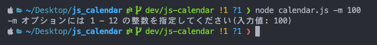

# js_calendar
## 実行環境
- macOS: Sonoma 14.7
- node.js: v22.16.0

## 実行方法
- 以下のコマンドをターミナルより入力することで、今月のカレンダーが表示されます。
```sh
$ node calendar.js
```
<br>

- `-m` オプションをつけることで任意の月（1-12の範囲）を表示することができます。
```sh
# 今年の６月を指定
$ node calendar.js -m 6
```

## 実行結果（実行日: 2025-08-12）
### -m オプションなし
```
$ node calendar.js
```


### -m オプションあり（6月を指定）
```
$ node calendar.js -m 6
```


### -m オプションあり（不正な値を入力）
```
$ node calendar.js -m 100
```
